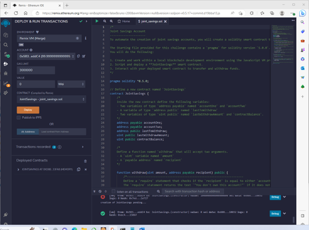
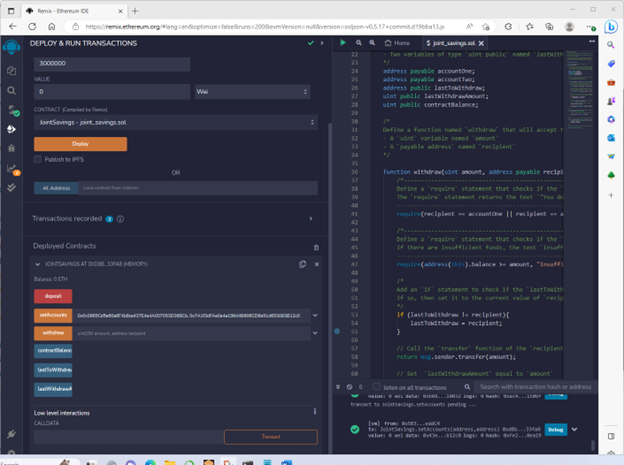
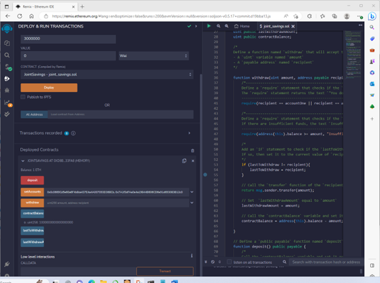
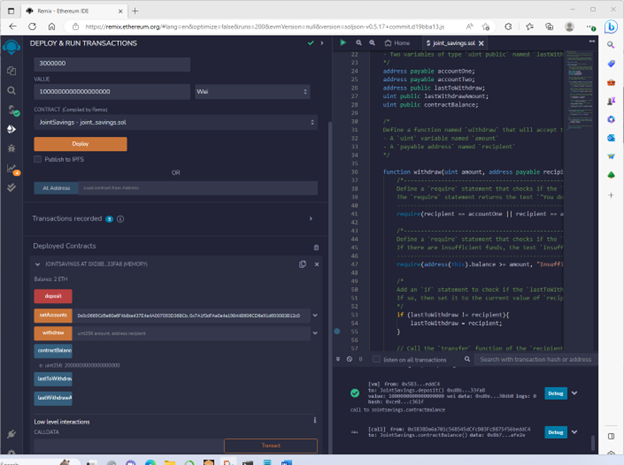
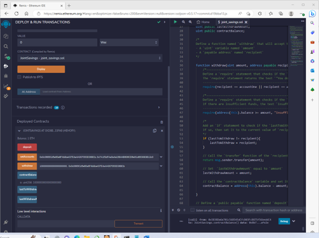
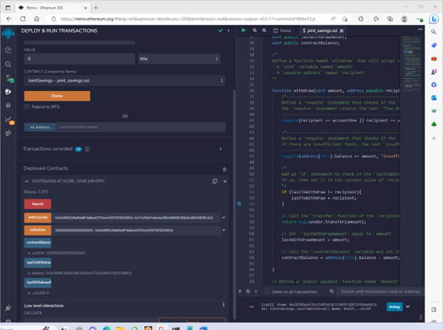

# Module20-HW.solidity
Module 20 homework - Solidity ReadME file

### (Dummy) Accounts used (used the ones provided in instructions)
AccountOne: 0x0c0669Cd5e60a6F4b8ce437E4a4A007093D368Cb
AccountTwo: 0x7A1f3dFAa0a4a19844B606CD6e91d693083B12c0

### Initial screenshot

UI/Screenshot seen upon deploying and running the contract.

### SetAccounts screenshot

Image of the initial screen before any 'transactions' have been initiated.

### Transaction #1 (1 Ether/1000000000000000000 Wei sent)

Screenshot showing details (including Contract balance) after the 1st transaction was executed.

### Transaction #2 (10 Ether/10000000000000000000 Wei sent)

Screenshot showing details (including Contract balance) after the 2nd transaction was executed.

### Transaction #3 (5 Ether/5000000000000000000 Wei sent)

Screenshot showing details (including Contract balance) after the 3rd transaction was executed.

### Transaction #4 (Withdraw 5 Ether/5000000000000000000 Wei into AccountTwo).

Screenshot showing details (including Contract balance) after the 4th transaction was executed.

### Transaction #5 (Withdraw 10 Ether/10000000000000000000 Wei into AccountOne).

Screenshot showing details (including Contract balance) after the 4th transaction was executed.

### 'lasttoWithdraw' value screenshot

Displaying 'lasttoWithdraw' value.
